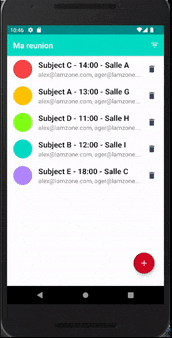
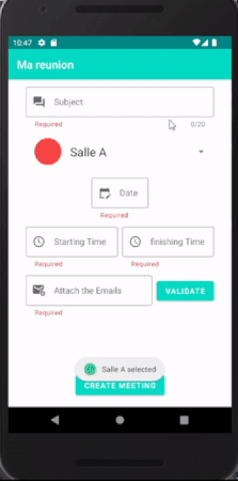
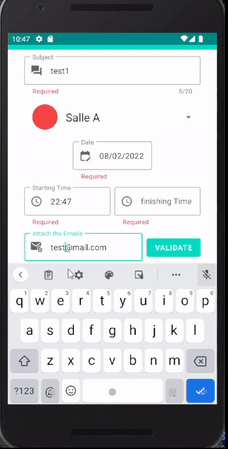

# Mareunion(Mymeeting in ENG)

Ce dépôt contient une mini-application pour le P4 du parcours **Grande École du Numérique**(OpenClassrooms).

## Table of contents
* [General info](#general-info)
* [Technologies](#Technologies)
* [Project setup](#Project-setup)
* [Project Architecture](#Project-Architecture)
* [Launch](#Launch)

## General info

This application's purpose is to help users manage their meetings
The application contains following fonctualities : 
1. Check meetings
2. Filter meetings 
3. Create meeting
4. Delete meeting

## Demo of end result

  
  
  

## Technologies
This application is created with:
* Java
* XML
* Android Studio

## Libraries
* Espresso Test
* Junit Test
* androidx test orchestrator
* EventBus(External) 

## Project Architecture
* MVC

## Launch
Download the code file or clone this repository and open via Android Studio

